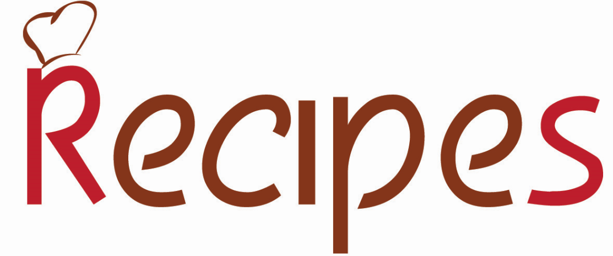

### Assignment 3.2

# Created by:
## Yuval Ben Eliezer (313581381) and Gal Rosenthal (312585268)

1. [ Logo ](#logo)
1. [Introduction ](#introduction)
1. [ API ](#ourAPI)

# Introduction
 

This is the frontend of our Recipe Site, we developed it in VueJS Framework
<i>an advanced javaScript framework used to build user interfaces</i>.

For the server side, we developed an API and worked with the site <a href="https://spoonacular.com/food-api">spoonacular</a> to get information about recipes,
and we also used azure cloud SQL as our Database.

All of this information and more you can find in the About Page in our website.

# API

 We are using the backend API we created in a previous version and 
 located at: https://github.com/SISE-Web-Development-Environments/assignment-3-2-yuval_gal_ass3-1/

